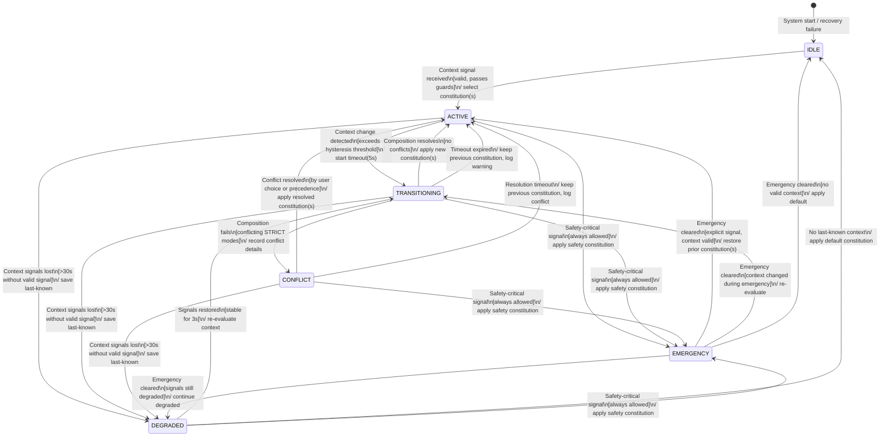

# VCP Adaptation State Machine

**Version**: 1.0.0
**Date**: 2026-02-15
**Layer**: VCP/A (Adaptation)
**Status**: Stable

> *Part of the Value-Context Protocol (VCP) - Layer 4*

---

## Abstract

This specification defines the formal state machine governing VCP context adaptation. It establishes six system states through which an AI system transitions as context signals arrive, change, degrade, or conflict. The state machine ensures deterministic, auditable, and fail-safe behavior during constitutional selection and composition.

This document complements [VCP_ADAPTATION.md](./VCP_ADAPTATION.md), which defines the Enneagram Protocol encoding and transition detection. Where that document specifies *what* context is and how it is parsed, this document specifies *how the system behaves* as context evolves over time.

---

## Table of Contents

1. [Introduction](#1-introduction)
2. [Terminology](#2-terminology)
3. [State Definitions](#3-state-definitions)
4. [State Diagram](#4-state-diagram)
5. [Transition Table](#5-transition-table)
6. [Hysteresis and Debouncing](#6-hysteresis-and-debouncing)
7. [State Persistence](#7-state-persistence)
8. [Error Handling and Recovery](#8-error-handling-and-recovery)
9. [Reference Implementation](#9-reference-implementation)
10. [Security Considerations](#10-security-considerations)
11. [Conformance](#11-conformance)

---

## 1. Introduction

### 1.1 Purpose

The VCP Adaptation State Machine provides:

- **Deterministic Behavior**: Every context signal produces a well-defined state transition or is explicitly rejected.
- **Fail-Safe Defaults**: Loss of context signals degrades gracefully rather than producing undefined behavior.
- **Conflict Resolution**: When multiple constitutions compete, the system enters a defined resolution state rather than silently choosing one.
- **Emergency Override**: Safety-critical signals can preempt any state unconditionally.
- **Auditability**: Every transition is logged with trigger, guard evaluation, and action taken.

### 1.2 Scope

This specification covers:

- The six adaptation states and their invariants
- All valid transitions, including guards and actions
- Hysteresis rules that prevent oscillation
- Persistence and recovery across sessions
- Error handling for malformed or adversarial inputs

This specification does NOT cover:

- The Enneagram Protocol encoding (see [VCP_ADAPTATION.md](./VCP_ADAPTATION.md))
- Constitution content or semantics (see [VCP_SEMANTICS_COMPOSITION.md](../semantics/VCP_SEMANTICS_COMPOSITION.md))
- Inter-agent messaging wire format (see [VCP_ADAPTATION.md](./VCP_ADAPTATION.md), Section 6)

### 1.3 Relationship to Other Layers

```
Layer 4 (Context)
  |
  +-- VCP_ADAPTATION.md        -- Enneagram Protocol, encoding, parsing
  +-- VCP_STATE_MACHINE.md     -- THIS DOCUMENT: system states, transitions
  |
  v
Layer 3 (Content/Semantics)
  |
  +-- VCP_SEMANTICS_COMPOSITION.md  -- Constitution composition, conflict resolution
```

The state machine operates *between* context signal reception (Layer 4 input) and constitution application (Layer 3 output). It is the control logic that decides *when* and *how* to invoke constitution selection and composition.

---

## 2. Terminology

The key words "MUST", "MUST NOT", "REQUIRED", "SHALL", "SHALL NOT", "SHOULD", "SHOULD NOT", "RECOMMENDED", "MAY", and "OPTIONAL" in this document are to be interpreted as described in [RFC 2119](https://datatracker.ietf.org/doc/html/rfc2119).

| Term | Definition |
|------|-----------|
| **Adaptation State** | One of the six defined system states governing constitutional selection behavior. |
| **Context Signal** | An Enneagram-encoded context string received from the environment, user, or another agent. |
| **Constitution** | A behavioral policy document selected and applied based on context. |
| **Composition** | The process of merging multiple constitutions into a coherent policy (see VCP_SEMANTICS_COMPOSITION). |
| **Dwell Time** | Minimum time the system MUST remain in a state before accepting a new transition. |
| **Guard** | A predicate that MUST evaluate to true before a transition fires. |
| **Hysteresis Threshold** | Minimum magnitude of context change required to trigger a transition. |
| **Last-Known Context** | The most recent valid context snapshot, used during DEGRADED operation. |
| **Safety Constitution** | The minimal constitution set applied during EMERGENCY, containing only safety-critical rules. |
| **Signal Stability Window** | Duration for which a context signal MUST remain unchanged before it is considered stable. |

---

## 3. State Definitions

### 3.1 IDLE

**Description**: No active context is loaded. The system applies its default constitution.

**Invariants**:
- No Enneagram context is bound.
- The default constitution (platform-level) MUST be active.
- The system MUST accept context signals.

**Entry Conditions**:
- System startup with no persisted state.
- Explicit context clear by user or administrator.
- Recovery failure (unable to restore persisted state).

**Behavior**:
- Respond using the default constitution only.
- Monitor for incoming context signals.

### 3.2 ACTIVE

**Description**: A valid context is loaded and one or more constitutions have been selected and applied.

**Invariants**:
- Exactly one canonical context string is bound.
- At least one constitution is selected and applied.
- The composition of selected constitutions MUST have resolved without conflict.

**Entry Conditions**:
- Transition from IDLE with a valid context signal.
- Transition from TRANSITIONING after successful constitution selection.
- Transition from CONFLICT after successful resolution.
- Transition from DEGRADED when context signals are restored.
- Transition from EMERGENCY when the safety-critical condition clears.

**Behavior**:
- Respond using the composed constitution set.
- Monitor for context changes that exceed the hysteresis threshold.
- Record the current state as last-known for DEGRADED fallback.

### 3.3 TRANSITIONING

**Description**: A significant context change has been detected. The system is evaluating which constitution(s) to apply under the new context.

**Invariants**:
- The previous constitution set remains active during evaluation (no gap in coverage).
- A timeout clock is running; the system MUST resolve or escalate within the timeout.
- The new context signal has passed validation.

**Entry Conditions**:
- Context change from ACTIVE that exceeds the hysteresis threshold.
- Context change from DEGRADED when new signals arrive that differ from last-known.

**Behavior**:
- Evaluate the new context against available constitutions.
- Attempt composition of candidate constitutions.
- If composition succeeds without conflict, transition to ACTIVE.
- If composition produces a conflict, transition to CONFLICT.
- If the timeout expires, fall back to the previous ACTIVE state and log a warning.

**Timeout**: 5 seconds (RECOMMENDED). Implementations MAY configure this but MUST NOT exceed 30 seconds.

### 3.4 CONFLICT

**Description**: Constitution composition has failed because multiple constitutions assert incompatible rules (e.g., two STRICT-mode constitutions with contradictory directives). Resolution is required before proceeding.

**Invariants**:
- The previous constitution set remains active (no gap).
- The specific conflict is recorded with both competing constitutions identified.
- A resolution strategy is being attempted or user input is being solicited.

**Entry Conditions**:
- Transition from TRANSITIONING when composition produces irreconcilable conflicts.

**Behavior**:
- Attempt automatic resolution using the precedence rules defined in [VCP_SEMANTICS_COMPOSITION](../semantics/VCP_SEMANTICS_COMPOSITION.md).
- If automatic resolution succeeds, transition to ACTIVE with the resolved set.
- If automatic resolution fails, solicit user or administrator input.
- If resolution timeout expires, remain on previous constitution set and log the unresolved conflict.

**Timeout**: 30 seconds (RECOMMENDED) for automatic resolution. User-prompted resolution MAY extend to session lifetime.

### 3.5 DEGRADED

**Description**: Context signals have been lost or become unreliable. The system continues operating on its last-known context and constitution set, or falls back to the default.

**Invariants**:
- Either last-known context or default constitution is active.
- The system MUST indicate degraded status in any audit trail or inter-agent messages.
- The system MUST continue monitoring for signal restoration.

**Entry Conditions**:
- Context signal source becomes unavailable for longer than 30 seconds.
- Context signals fail validation repeatedly (3+ consecutive failures).
- The system detects contradictory signals from the same source (possible spoofing).

**Behavior**:
- Continue with last-known context and constitution, if available.
- If no last-known context exists, revert to IDLE (default constitution).
- Periodically attempt to re-establish context signals (RECOMMENDED: every 10 seconds).
- When signals are restored and stable, transition to TRANSITIONING to re-evaluate.

### 3.6 EMERGENCY

**Description**: A safety-critical signal has been received. The system overrides all normal constitutional logic and applies the minimal safety constitution set.

**Invariants**:
- The safety constitution MUST be active. No other constitution MAY override safety directives.
- The emergency trigger MUST be logged with full context for audit.
- The system MUST remain in EMERGENCY until the safety-critical condition is explicitly cleared.

**Entry Conditions**:
- Reception of an emergency context indicator (Enneagram: `🚨` in OCCASION or CONSTRAINTS, `🔥` or `🌪️` in ENVIRONMENT).
- External safety-critical signal from a trusted source.
- Detection of an active threat pattern (implementation-defined).

**Behavior**:
- Immediately apply the safety constitution, overriding all current rules.
- Suspend non-essential constitutional logic.
- Notify all connected agents via VCP inter-agent messaging.
- Log the emergency event with timestamp, trigger, and prior state.
- When the emergency condition clears (explicit signal or timeout), transition back to the prior state or to TRANSITIONING for re-evaluation.

**Timeout**: No automatic timeout. EMERGENCY persists until explicitly cleared. Implementations MAY define a maximum duration (RECOMMENDED: session lifetime) after which the system transitions to DEGRADED with a logged notice.

---

## 4. State Diagram

### 4.1 Mermaid Diagram



### 4.2 Text Diagram

```
                        +--------------------------------------------------+
                        |          EMERGENCY (safety override)              |
                        |  ANY state ---[safety signal]--> EMERGENCY       |
                        +------+---+---+---+-------------------------------+
                               |   |   |   |
                      cleared  |   |   |   |  cleared
                 (ctx valid)   |   |   |   |  (ctx changed)
                               v   |   |   v
  +-------+  ctx signal  +---------+   +-------------+  composition ok  +---------+
  |       | -----------> |         |   |             | ----------------> |         |
  | IDLE  |              | ACTIVE  |<--|TRANSITIONING|                   | ACTIVE  |
  |       | <----------- |         |-->|             |--+               |         |
  +---+---+  ctx clear   +----+----+   +------+------+  |conflict      +----+----+
      ^                       |               ^          v                   |
      |                       |               |    +----------+              |
      |                       | signals lost  |    | CONFLICT |---resolved-->+
      |                       v               |    +----------+
      |                  +----------+         |
      +--no last-known---| DEGRADED |-signals-+
                         +----------+ restored
```

---

## 5. Transition Table

### 5.1 Complete Transition Matrix

| # | From | To | Trigger | Guard | Action | Timeout |
|---|------|----|---------|-------|--------|---------|
| T1 | IDLE | ACTIVE | Context signal received | Signal passes validation AND at least one constitution matches | Parse context, select constitution(s), compose, bind | -- |
| T2 | ACTIVE | TRANSITIONING | Context change detected | Change exceeds hysteresis threshold (see Section 6) AND dwell time elapsed | Snapshot current state as fallback, start transition timer | 5s |
| T3 | TRANSITIONING | ACTIVE | Composition resolves | No conflicts in composed constitution set | Apply new constitution(s), update last-known, reset dwell timer | -- |
| T4 | TRANSITIONING | CONFLICT | Composition fails | Two or more constitutions in STRICT mode assert contradictory rules | Record conflict details, begin resolution strategy | 30s |
| T5 | TRANSITIONING | ACTIVE | Transition timeout | Timer expires before composition completes | Revert to previous constitution, log warning with context details | -- |
| T6 | CONFLICT | ACTIVE | Conflict resolved | Resolution strategy succeeds (precedence, user choice, or fallback) | Apply resolved constitution(s), clear conflict record | -- |
| T7 | CONFLICT | ACTIVE | Resolution timeout | Timer expires before conflict resolves | Keep previous constitution, log unresolved conflict for audit | -- |
| T8 | ANY | EMERGENCY | Safety-critical signal | Signal is from a trusted source OR matches emergency indicators | Apply safety constitution, log emergency, notify agents | None |
| T9 | ANY | DEGRADED | Context signals lost | No valid context signal received for >30s OR 3+ consecutive validation failures | Save last-known context, set degraded flag, begin signal polling | -- |
| T10 | DEGRADED | TRANSITIONING | Signals restored | New signal is valid AND stable for signal stability window (3s) | Begin evaluation with new context | 5s |
| T11 | DEGRADED | IDLE | No last-known available | Last-known context is null or expired | Revert to default constitution | -- |
| T12 | EMERGENCY | ACTIVE | Emergency cleared | Explicit clear signal AND prior context is still valid | Restore prior constitution set | -- |
| T13 | EMERGENCY | TRANSITIONING | Emergency cleared, context changed | Explicit clear signal AND context changed during emergency | Begin evaluation with current context | 5s |
| T14 | EMERGENCY | IDLE | Emergency cleared, no context | Explicit clear signal AND no valid context available | Apply default constitution | -- |
| T15 | EMERGENCY | DEGRADED | Emergency cleared, signals degraded | Explicit clear signal AND context signals still unavailable | Continue with last-known or default | -- |

### 5.2 Invalid Transitions

The following transitions are explicitly FORBIDDEN:

| From | To | Reason |
|------|----|--------|
| IDLE | TRANSITIONING | IDLE has no prior context to transition from; must go through ACTIVE first. |
| IDLE | CONFLICT | No composition is in progress during IDLE. |
| CONFLICT | TRANSITIONING | Conflicts MUST resolve to ACTIVE first; new transitions start from ACTIVE. |
| ACTIVE | CONFLICT | ACTIVE state implies composition has already resolved. Conflicts only arise during TRANSITIONING. |
| ACTIVE | IDLE | Context is not "unloaded"; it is replaced (via TRANSITIONING) or lost (via DEGRADED). Explicit clear resets to IDLE. |

### 5.3 Self-Transitions

| State | Trigger | Guard | Action |
|-------|---------|-------|--------|
| ACTIVE | Minor context change | Change below hysteresis threshold | Log minor change, no state transition |
| DEGRADED | Signal poll fails | Signal source still unavailable | Increment failure counter, schedule next poll |
| EMERGENCY | Additional emergency signal | Already in EMERGENCY | Log additional signal, merge into emergency record |

---

## 6. Hysteresis and Debouncing

### 6.1 Purpose

Hysteresis prevents the state machine from oscillating between ACTIVE and TRANSITIONING in response to noisy or rapidly fluctuating context signals. Debouncing ensures that transient signal spikes do not trigger costly re-evaluation.

### 6.2 Minimum Dwell Time

An implementation MUST enforce a minimum dwell time before accepting a new transition out of any state:

| State | Minimum Dwell Time | Notes |
|-------|--------------------|-------|
| IDLE | 0s | May transition immediately on first signal. |
| ACTIVE | 10s | Prevents rapid re-evaluation churn. |
| TRANSITIONING | 0s | Transient state; exits as fast as evaluation completes. |
| CONFLICT | 0s | Transient state; exits when resolved. |
| DEGRADED | 10s | Prevents flapping between DEGRADED and TRANSITIONING. |
| EMERGENCY | 0s | May exit immediately when cleared (safety takes priority). |

The dwell time clock resets each time the state is entered. Context changes that arrive during the dwell period MUST be queued and evaluated when the dwell period expires. If multiple changes queue, only the most recent SHALL be evaluated.

**Exception**: Transitions T8 (ANY -> EMERGENCY) and T9 (ANY -> DEGRADED) are exempt from dwell time. Safety-critical signals and signal loss MUST NOT be deferred.

### 6.3 Signal Stability Window

A context signal MUST remain stable (unchanged) for the **signal stability window** before it triggers a transition:

- **Default window**: 3 seconds
- **Emergency signals**: 0 seconds (immediate)
- **Implementations**: MAY configure between 1s and 10s; MUST NOT exceed 10s

"Stable" means the same canonical context string is received (or inferred) across consecutive evaluations within the window. If the signal changes during the window, the window resets.

### 6.4 Change Magnitude Threshold

Not all context changes warrant a state transition. The **hysteresis threshold** defines the minimum magnitude of change:

A context change exceeds the hysteresis threshold if ANY of the following conditions hold:

1. **Dimension Count**: At least 2 Enneagram dimensions have changed values.
2. **Single Dimension Magnitude**: At least 1 dimension has changed by 2 or more levels (where "level" is defined as the ordinal distance between values in a dimension's value set).
3. **Safety-Relevant Change**: Any change in COMPANY (children appearing/disappearing), OCCASION (emergency indicator), ENVIRONMENT (hazard indicator), or CONSTRAINTS (emergency protocol) -- regardless of magnitude.

```python
def exceeds_hysteresis_threshold(old: ParsedContext, new: ParsedContext) -> bool:
    """
    Determine whether the difference between two contexts exceeds
    the hysteresis threshold for triggering a state transition.

    Returns True if a transition SHOULD be triggered.
    """
    SAFETY_DIMENSIONS = {'company', 'occasion', 'environment', 'constraints'}
    SAFETY_INDICATORS = {'🚨', '🔥', '🌪️', '👶'}

    changed_dims = []
    safety_change = False

    for dim in ['time', 'space', 'company', 'culture', 'occasion',
                'state', 'environment', 'agency', 'constraints']:
        old_val = set(getattr(old, dim, []))
        new_val = set(getattr(new, dim, []))

        if old_val != new_val:
            changed_dims.append(dim)

            # Check for safety-relevant changes
            if dim in SAFETY_DIMENSIONS:
                symmetric_diff = old_val ^ new_val
                if symmetric_diff & SAFETY_INDICATORS:
                    safety_change = True

    # Rule 1: At least 2 dimensions changed
    if len(changed_dims) >= 2:
        return True

    # Rule 2: Single dimension changed by 2+ levels
    # (Implementation note: requires ordinal mapping per dimension)
    for dim in changed_dims:
        if _ordinal_distance(dim, old, new) >= 2:
            return True

    # Rule 3: Safety-relevant change
    if safety_change:
        return True

    return False
```

### 6.5 Debounce Interaction

The three hysteresis mechanisms interact as follows:

```
Signal received
    |
    v
[Signal Stability Window: 3s]
    |  (signal unchanged for 3s)
    v
[Change Magnitude Threshold]
    |  (exceeds threshold?)
    | NO --> log minor change, stay in current state
    | YES
    v
[Dwell Time Check]
    |  (minimum time in current state elapsed?)
    | NO --> queue change, evaluate after dwell expires
    | YES
    v
[Fire Transition]
```

---

## 7. State Persistence

### 7.1 Within a Session

The adaptation state MUST persist for the lifetime of a session. An implementation MUST maintain:

| Datum | Required | Description |
|-------|----------|-------------|
| `current_state` | REQUIRED | The current adaptation state (one of the six). |
| `current_context` | REQUIRED | The canonical Enneagram context string. |
| `active_constitutions` | REQUIRED | List of currently applied constitution references. |
| `last_known_context` | REQUIRED | Snapshot for DEGRADED fallback. |
| `state_entered_at` | REQUIRED | Timestamp when current state was entered (for dwell time). |
| `transition_history` | RECOMMENDED | Ordered log of state transitions for audit. |
| `conflict_record` | CONDITIONAL | Active conflict details, if in CONFLICT state. |
| `emergency_record` | CONDITIONAL | Emergency trigger details, if in EMERGENCY state. |

### 7.2 Cross-Session Persistence

Cross-session persistence is OPTIONAL. When implemented, the following strategies are supported:

#### 7.2.1 Redis

```python
import json
import redis
from datetime import datetime

class RedisStatePersistence:
    """Persist adaptation state to Redis."""

    KEY_PREFIX = "vcp:adaptation:state:"
    DEFAULT_TTL = 86400  # 24 hours

    def __init__(self, client: redis.Redis, ttl: int = DEFAULT_TTL):
        self.client = client
        self.ttl = ttl

    def save(self, session_id: str, state: dict) -> None:
        """Save adaptation state for a session."""
        key = f"{self.KEY_PREFIX}{session_id}"
        payload = {
            "current_state": state["current_state"],
            "current_context": state["current_context"],
            "active_constitutions": state["active_constitutions"],
            "last_known_context": state["last_known_context"],
            "saved_at": datetime.utcnow().isoformat(),
            "version": "1.0.0",
        }
        self.client.setex(key, self.ttl, json.dumps(payload))

    def load(self, session_id: str) -> dict | None:
        """Load adaptation state for a session. Returns None if not found or expired."""
        key = f"{self.KEY_PREFIX}{session_id}"
        raw = self.client.get(key)
        if raw is None:
            return None
        return json.loads(raw)
```

#### 7.2.2 File-Based

```python
import json
from pathlib import Path
from datetime import datetime

class FileStatePersistence:
    """Persist adaptation state to local file."""

    def __init__(self, base_dir: Path):
        self.base_dir = base_dir
        self.base_dir.mkdir(parents=True, exist_ok=True)

    def save(self, session_id: str, state: dict) -> None:
        """Save adaptation state for a session."""
        path = self.base_dir / f"{session_id}.json"
        payload = {
            "current_state": state["current_state"],
            "current_context": state["current_context"],
            "active_constitutions": state["active_constitutions"],
            "last_known_context": state["last_known_context"],
            "saved_at": datetime.utcnow().isoformat(),
            "version": "1.0.0",
        }
        path.write_text(json.dumps(payload, indent=2))

    def load(self, session_id: str) -> dict | None:
        """Load adaptation state for a session."""
        path = self.base_dir / f"{session_id}.json"
        if not path.exists():
            return None
        return json.loads(path.read_text())
```

#### 7.2.3 Opaque Token

For stateless transports (e.g., HTTP headers), the adaptation state MAY be serialized into an opaque, signed token:

```python
import hmac
import hashlib
import base64
import json
from datetime import datetime

class OpaqueTokenPersistence:
    """Encode adaptation state as a signed, opaque token."""

    def __init__(self, secret: bytes):
        self.secret = secret

    def encode(self, state: dict) -> str:
        """Encode state into a signed token."""
        payload = json.dumps({
            "s": state["current_state"],
            "c": state["current_context"],
            "a": state["active_constitutions"],
            "l": state["last_known_context"],
            "t": datetime.utcnow().isoformat(),
        }, separators=(",", ":"))
        payload_b64 = base64.urlsafe_b64encode(payload.encode()).decode()
        signature = hmac.new(self.secret, payload_b64.encode(), hashlib.sha256).hexdigest()[:16]
        return f"{payload_b64}.{signature}"

    def decode(self, token: str) -> dict | None:
        """Decode and verify a signed token."""
        parts = token.rsplit(".", 1)
        if len(parts) != 2:
            return None
        payload_b64, signature = parts
        expected = hmac.new(self.secret, payload_b64.encode(), hashlib.sha256).hexdigest()[:16]
        if not hmac.compare_digest(signature, expected):
            return None
        payload = json.loads(base64.urlsafe_b64decode(payload_b64).decode())
        return {
            "current_state": payload["s"],
            "current_context": payload["c"],
            "active_constitutions": payload["a"],
            "last_known_context": payload["l"],
        }
```

### 7.3 Recovery on Session Start

On session initialization, the system MUST follow this recovery procedure:

```
Session Start
    |
    v
[Attempt to load persisted state]
    |
    +-- Found and valid --> [Validate persisted context]
    |                           |
    |                           +-- Context still valid --> Enter ACTIVE
    |                           +-- Context stale/changed --> Enter TRANSITIONING
    |                           +-- Context unavailable --> Enter DEGRADED (with last-known)
    |
    +-- Not found / corrupted / expired --> Enter IDLE
```

An implementation MUST NOT trust persisted state blindly. The persisted context MUST be re-validated against current conditions before entering ACTIVE.

---

## 8. Error Handling and Recovery

### 8.1 Error Categories

| Category | Examples | Handling |
|----------|----------|----------|
| **Validation Error** | Malformed context string, unknown dimension values | Reject the signal, remain in current state, log warning. |
| **Composition Error** | Constitution not found, schema mismatch | Transition to DEGRADED if current constitution becomes unavailable; log error. |
| **Timeout Error** | TRANSITIONING exceeds 5s, CONFLICT exceeds 30s | Revert to previous state (ACTIVE with prior constitution), log timeout. |
| **Persistence Error** | Redis unavailable, file I/O failure | Continue with in-memory state, log degraded persistence. |
| **Security Error** | Invalid signature, suspected spoofing | Reject the signal, increment anomaly counter; if threshold exceeded, enter DEGRADED. |

### 8.2 Anomaly Detection

Implementations SHOULD track anomalies to detect adversarial context manipulation:

```python
from dataclasses import dataclass, field
from datetime import datetime, timedelta
from collections import deque

@dataclass
class AnomalyTracker:
    """Track context signal anomalies for spoofing detection."""

    window: timedelta = field(default_factory=lambda: timedelta(minutes=5))
    threshold: int = 10  # anomalies per window
    events: deque = field(default_factory=deque)

    def record(self, anomaly_type: str, details: str) -> None:
        """Record an anomaly event."""
        now = datetime.utcnow()
        self.events.append({"type": anomaly_type, "details": details, "at": now})
        # Prune old events
        cutoff = now - self.window
        while self.events and self.events[0]["at"] < cutoff:
            self.events.popleft()

    def is_under_attack(self) -> bool:
        """Check if anomaly rate exceeds threshold."""
        return len(self.events) >= self.threshold

    def get_recommendation(self) -> str:
        """Recommend action based on anomaly state."""
        if self.is_under_attack():
            return "DEGRADE"  # Enter DEGRADED, stop trusting signals
        if len(self.events) > self.threshold // 2:
            return "WARN"  # Log warnings, increase scrutiny
        return "NORMAL"
```

### 8.3 Impossible Transition Detection

If the state machine receives a transition request that is not in the valid transition table (Section 5), the implementation MUST:

1. Reject the transition.
2. Log the attempted transition with full context (from-state, to-state, trigger, timestamp).
3. Remain in the current state.
4. If 3 or more impossible transitions are detected within 60 seconds, enter DEGRADED and log a security warning.

### 8.4 State Machine Corruption Recovery

If the state machine's internal state becomes inconsistent (e.g., `current_state` is ACTIVE but no constitutions are bound), the implementation MUST:

1. Log the inconsistency with full internal state dump.
2. Attempt to repair: re-select constitutions for the current context.
3. If repair succeeds, remain in ACTIVE.
4. If repair fails, transition to IDLE and clear all state.

---

## 9. Reference Implementation

### 9.1 Core State Machine

```python
from enum import Enum
from dataclasses import dataclass, field
from datetime import datetime, timedelta
from typing import Optional, Callable

class AdaptationState(Enum):
    """The six adaptation states."""
    IDLE = "IDLE"
    ACTIVE = "ACTIVE"
    TRANSITIONING = "TRANSITIONING"
    CONFLICT = "CONFLICT"
    DEGRADED = "DEGRADED"
    EMERGENCY = "EMERGENCY"


@dataclass
class TransitionRecord:
    """Record of a state transition for audit."""
    from_state: AdaptationState
    to_state: AdaptationState
    trigger: str
    timestamp: datetime
    context_before: Optional[str] = None
    context_after: Optional[str] = None
    details: Optional[str] = None


@dataclass
class ConflictRecord:
    """Details of an unresolved constitution conflict."""
    constitution_a: str
    constitution_b: str
    conflicting_rules: list
    detected_at: datetime
    resolution_strategy: Optional[str] = None


@dataclass
class EmergencyRecord:
    """Details of an emergency event."""
    trigger_signal: str
    prior_state: AdaptationState
    prior_context: Optional[str]
    prior_constitutions: list
    activated_at: datetime


class AdaptationStateMachine:
    """
    VCP Adaptation State Machine reference implementation.

    Manages the lifecycle of context-driven constitutional selection.
    """

    # Configuration
    TRANSITION_TIMEOUT = timedelta(seconds=5)
    CONFLICT_TIMEOUT = timedelta(seconds=30)
    SIGNAL_LOSS_THRESHOLD = timedelta(seconds=30)
    SIGNAL_STABILITY_WINDOW = timedelta(seconds=3)
    DWELL_TIMES = {
        AdaptationState.IDLE: timedelta(seconds=0),
        AdaptationState.ACTIVE: timedelta(seconds=10),
        AdaptationState.TRANSITIONING: timedelta(seconds=0),
        AdaptationState.CONFLICT: timedelta(seconds=0),
        AdaptationState.DEGRADED: timedelta(seconds=10),
        AdaptationState.EMERGENCY: timedelta(seconds=0),
    }

    # Valid transitions: (from_state, to_state) -> True
    VALID_TRANSITIONS = {
        (AdaptationState.IDLE, AdaptationState.ACTIVE),
        (AdaptationState.ACTIVE, AdaptationState.TRANSITIONING),
        (AdaptationState.ACTIVE, AdaptationState.DEGRADED),
        (AdaptationState.ACTIVE, AdaptationState.EMERGENCY),
        (AdaptationState.TRANSITIONING, AdaptationState.ACTIVE),
        (AdaptationState.TRANSITIONING, AdaptationState.CONFLICT),
        (AdaptationState.TRANSITIONING, AdaptationState.EMERGENCY),
        (AdaptationState.TRANSITIONING, AdaptationState.DEGRADED),
        (AdaptationState.CONFLICT, AdaptationState.ACTIVE),
        (AdaptationState.CONFLICT, AdaptationState.EMERGENCY),
        (AdaptationState.CONFLICT, AdaptationState.DEGRADED),
        (AdaptationState.DEGRADED, AdaptationState.TRANSITIONING),
        (AdaptationState.DEGRADED, AdaptationState.IDLE),
        (AdaptationState.DEGRADED, AdaptationState.EMERGENCY),
        (AdaptationState.EMERGENCY, AdaptationState.ACTIVE),
        (AdaptationState.EMERGENCY, AdaptationState.TRANSITIONING),
        (AdaptationState.EMERGENCY, AdaptationState.IDLE),
        (AdaptationState.EMERGENCY, AdaptationState.DEGRADED),
    }

    def __init__(
        self,
        constitution_selector: Callable,
        constitution_composer: Callable,
        safety_constitution: str = "creed://creed.space/safety.minimal@1.0.0",
        default_constitution: str = "creed://creed.space/platform.default@1.0.0",
    ):
        self.constitution_selector = constitution_selector
        self.constitution_composer = constitution_composer
        self.safety_constitution = safety_constitution
        self.default_constitution = default_constitution

        # State
        self._state = AdaptationState.IDLE
        self._state_entered_at = datetime.utcnow()
        self._current_context: Optional[str] = None
        self._active_constitutions: list[str] = [default_constitution]
        self._last_known_context: Optional[str] = None
        self._last_signal_at: Optional[datetime] = None

        # Records
        self._transition_history: list[TransitionRecord] = []
        self._conflict_record: Optional[ConflictRecord] = None
        self._emergency_record: Optional[EmergencyRecord] = None

        # Queues
        self._pending_context: Optional[str] = None
        self._stable_since: Optional[datetime] = None
        self._stable_context: Optional[str] = None

    @property
    def state(self) -> AdaptationState:
        """Current adaptation state."""
        return self._state

    @property
    def context(self) -> Optional[str]:
        """Current bound context."""
        return self._current_context

    @property
    def constitutions(self) -> list[str]:
        """Currently active constitutions."""
        return list(self._active_constitutions)

    def _can_transition(self, to_state: AdaptationState) -> bool:
        """Check if transition is valid."""
        return (self._state, to_state) in self.VALID_TRANSITIONS

    def _dwell_elapsed(self) -> bool:
        """Check if minimum dwell time has elapsed."""
        dwell = self.DWELL_TIMES[self._state]
        return (datetime.utcnow() - self._state_entered_at) >= dwell

    def _enter_state(self, new_state: AdaptationState, trigger: str,
                     context_after: Optional[str] = None, details: Optional[str] = None) -> None:
        """Transition to a new state with full audit logging."""
        if not self._can_transition(new_state):
            raise InvalidTransitionError(
                f"Cannot transition from {self._state.value} to {new_state.value}"
            )

        record = TransitionRecord(
            from_state=self._state,
            to_state=new_state,
            trigger=trigger,
            timestamp=datetime.utcnow(),
            context_before=self._current_context,
            context_after=context_after,
            details=details,
        )
        self._transition_history.append(record)

        self._state = new_state
        self._state_entered_at = datetime.utcnow()

    # --- Public API ---

    def receive_signal(self, context: str) -> AdaptationState:
        """
        Process an incoming context signal.

        This is the primary entry point for the state machine.
        Handles validation, stability checking, hysteresis, and transition logic.

        Args:
            context: Canonical Enneagram context string.

        Returns:
            The resulting adaptation state after processing.

        Raises:
            ValidationError: If the context string is malformed.
        """
        now = datetime.utcnow()
        self._last_signal_at = now

        # Validate
        parsed = parse_context(context)
        canonical = canonicalize_context(context)

        # Check for emergency indicators
        if parsed.has_emergency():
            self._trigger_emergency(canonical)
            return self._state

        # Signal stability check
        if canonical != self._stable_context:
            self._stable_context = canonical
            self._stable_since = now
            return self._state  # Wait for stability window

        if (now - self._stable_since) < self.SIGNAL_STABILITY_WINDOW:
            return self._state  # Still waiting for stability

        # Process based on current state
        if self._state == AdaptationState.IDLE:
            return self._handle_idle_signal(canonical, parsed)
        elif self._state == AdaptationState.ACTIVE:
            return self._handle_active_signal(canonical, parsed)
        elif self._state == AdaptationState.DEGRADED:
            return self._handle_degraded_signal(canonical, parsed)
        else:
            # TRANSITIONING, CONFLICT: queue for later
            self._pending_context = canonical
            return self._state

    def clear_emergency(self) -> AdaptationState:
        """
        Explicitly clear an emergency condition.

        Returns:
            The resulting state after clearing.
        """
        if self._state != AdaptationState.EMERGENCY:
            return self._state

        if self._emergency_record is None:
            self._enter_state(AdaptationState.IDLE, "emergency_cleared_no_record")
            return self._state

        prior = self._emergency_record.prior_state
        prior_ctx = self._emergency_record.prior_context
        self._emergency_record = None

        if self._last_signal_at is None or \
           (datetime.utcnow() - self._last_signal_at) > self.SIGNAL_LOSS_THRESHOLD:
            self._enter_state(AdaptationState.DEGRADED, "emergency_cleared_signals_degraded")
        elif prior_ctx and prior_ctx == self._current_context:
            self._active_constitutions = list(self._emergency_record.prior_constitutions) \
                if self._emergency_record else [self.default_constitution]
            self._enter_state(AdaptationState.ACTIVE, "emergency_cleared_context_valid",
                              context_after=prior_ctx)
        elif prior_ctx:
            self._enter_state(AdaptationState.TRANSITIONING,
                              "emergency_cleared_context_changed")
        else:
            self._enter_state(AdaptationState.IDLE, "emergency_cleared_no_context")

        return self._state

    def tick(self) -> AdaptationState:
        """
        Periodic tick for timeout and signal-loss detection.

        Implementations SHOULD call this at regular intervals (RECOMMENDED: every 1s).

        Returns:
            Current state (may have changed due to timeout/signal-loss).
        """
        now = datetime.utcnow()

        # Check for signal loss (except in IDLE and EMERGENCY)
        if self._state not in (AdaptationState.IDLE, AdaptationState.EMERGENCY):
            if self._last_signal_at and \
               (now - self._last_signal_at) > self.SIGNAL_LOSS_THRESHOLD:
                self._last_known_context = self._current_context
                self._enter_state(AdaptationState.DEGRADED, "signal_loss_detected")
                return self._state

        # Check for transition timeout
        if self._state == AdaptationState.TRANSITIONING:
            if (now - self._state_entered_at) > self.TRANSITION_TIMEOUT:
                self._enter_state(AdaptationState.ACTIVE, "transition_timeout",
                                  details="Reverted to previous constitution")
                return self._state

        # Check for conflict resolution timeout
        if self._state == AdaptationState.CONFLICT:
            if (now - self._state_entered_at) > self.CONFLICT_TIMEOUT:
                self._conflict_record = None
                self._enter_state(AdaptationState.ACTIVE, "conflict_resolution_timeout",
                                  details="Kept previous constitution, conflict unresolved")
                return self._state

        return self._state

    # --- Private Handlers ---

    def _handle_idle_signal(self, context: str, parsed) -> AdaptationState:
        """Handle a context signal while in IDLE."""
        candidates = self.constitution_selector(context)
        if not candidates:
            return self._state  # No matching constitutions; stay IDLE

        composed = self.constitution_composer(candidates)
        self._current_context = context
        self._active_constitutions = composed
        self._last_known_context = context
        self._enter_state(AdaptationState.ACTIVE, "context_signal_received",
                          context_after=context)
        return self._state

    def _handle_active_signal(self, context: str, parsed) -> AdaptationState:
        """Handle a context signal while in ACTIVE."""
        if context == self._current_context:
            return self._state  # No change

        old_parsed = parse_context(self._current_context)
        if not exceeds_hysteresis_threshold(old_parsed, parsed):
            return self._state  # Below threshold

        if not self._dwell_elapsed():
            self._pending_context = context
            return self._state  # Queued

        self._enter_state(AdaptationState.TRANSITIONING, "context_change_detected",
                          context_after=context)
        self._attempt_composition(context)
        return self._state

    def _handle_degraded_signal(self, context: str, parsed) -> AdaptationState:
        """Handle a context signal while in DEGRADED."""
        self._enter_state(AdaptationState.TRANSITIONING, "signals_restored",
                          context_after=context)
        self._attempt_composition(context)
        return self._state

    def _attempt_composition(self, context: str) -> None:
        """Attempt to select and compose constitutions for a context."""
        candidates = self.constitution_selector(context)
        if not candidates:
            # No match: revert
            self._enter_state(AdaptationState.ACTIVE, "no_matching_constitutions",
                              details="Kept previous constitution")
            return

        try:
            composed = self.constitution_composer(candidates)
        except ConstitutionConflictError as e:
            self._conflict_record = ConflictRecord(
                constitution_a=e.constitution_a,
                constitution_b=e.constitution_b,
                conflicting_rules=e.conflicting_rules,
                detected_at=datetime.utcnow(),
            )
            self._enter_state(AdaptationState.CONFLICT, "composition_conflict",
                              details=str(e))
            return

        self._current_context = context
        self._active_constitutions = composed
        self._last_known_context = context
        self._enter_state(AdaptationState.ACTIVE, "composition_resolved",
                          context_after=context)

    def _trigger_emergency(self, context: str) -> None:
        """Enter EMERGENCY state from any state."""
        self._emergency_record = EmergencyRecord(
            trigger_signal=context,
            prior_state=self._state,
            prior_context=self._current_context,
            prior_constitutions=list(self._active_constitutions),
            activated_at=datetime.utcnow(),
        )
        self._active_constitutions = [self.safety_constitution]
        self._current_context = context

        # EMERGENCY is always valid from any state
        record = TransitionRecord(
            from_state=self._state,
            to_state=AdaptationState.EMERGENCY,
            trigger="safety_critical_signal",
            timestamp=datetime.utcnow(),
            context_before=self._emergency_record.prior_context,
            context_after=context,
        )
        self._transition_history.append(record)
        self._state = AdaptationState.EMERGENCY
        self._state_entered_at = datetime.utcnow()


class InvalidTransitionError(Exception):
    """Raised when an invalid state transition is attempted."""
    pass


class ConstitutionConflictError(Exception):
    """Raised when constitution composition encounters irreconcilable conflicts."""
    def __init__(self, message: str, constitution_a: str, constitution_b: str,
                 conflicting_rules: list):
        super().__init__(message)
        self.constitution_a = constitution_a
        self.constitution_b = constitution_b
        self.conflicting_rules = conflicting_rules
```

### 9.2 Usage Example

```python
# Initialize
def select_constitutions(context: str) -> list[str]:
    """Select constitutions matching a context. (Stub for illustration.)"""
    parsed = parse_context(context)
    if parsed.has_children():
        return ["creed://creed.space/family.safe.guide@1.2.0"]
    if parsed.is_professional():
        return ["creed://creed.space/professional.standard@1.0.0"]
    return ["creed://creed.space/platform.default@1.0.0"]


def compose_constitutions(candidates: list[str]) -> list[str]:
    """Compose constitutions. Raises ConstitutionConflictError on conflict."""
    # Simplified: return as-is
    return candidates


sm = AdaptationStateMachine(
    constitution_selector=select_constitutions,
    constitution_composer=compose_constitutions,
)

# Session start: IDLE
assert sm.state == AdaptationState.IDLE

# First context signal: IDLE -> ACTIVE
sm.receive_signal("⏰🌅|📍🏡|👥👶")
# (after stability window)
sm.receive_signal("⏰🌅|📍🏡|👥👶")
assert sm.state == AdaptationState.ACTIVE
assert "family.safe.guide" in sm.constitutions[0]

# Context change: ACTIVE -> TRANSITIONING -> ACTIVE
# (after dwell time of 10s)
sm.receive_signal("📍🏢|👥👔|🔶⚖️")
sm.receive_signal("📍🏢|👥👔|🔶⚖️")
# State transitions through TRANSITIONING and resolves to ACTIVE

# Emergency: ANY -> EMERGENCY
sm.receive_signal("🎭🚨|🧠😰|🔶🚨")
assert sm.state == AdaptationState.EMERGENCY

# Clear emergency
sm.clear_emergency()
```

---

## 10. Security Considerations

### 10.1 Emergency Signal Abuse

**Threat**: An adversary injects false emergency signals to force the system into EMERGENCY, bypassing normal constitutional logic.

**Mitigations**:
- Emergency signals SHOULD be verified against a trusted source before triggering T8.
- Implementations MUST rate-limit emergency transitions: no more than 3 EMERGENCY entries per 5-minute window.
- All emergency events MUST be logged for post-hoc audit.
- Repeated false emergencies SHOULD trigger an alert to human administrators.

### 10.2 Context Signal Spoofing

**Threat**: An adversary manipulates context signals to steer constitutional selection toward a permissive configuration.

**Mitigations**:
- Context signals SHOULD be cryptographically signed by their source.
- The anomaly tracker (Section 8.2) detects rapid or impossible context changes.
- Implementations SHOULD validate context plausibility (e.g., a transition from `📍🏡` to `📍🏢` in under 1 second is implausible).

### 10.3 Denial-of-Service via Oscillation

**Threat**: An adversary sends rapidly alternating context signals to keep the system permanently in TRANSITIONING.

**Mitigations**:
- Hysteresis rules (Section 6) prevent transitions below the change magnitude threshold.
- The signal stability window (3s) absorbs rapid oscillation.
- The dwell time (10s) prevents re-entry to TRANSITIONING before settling.
- If TRANSITIONING is entered more than 6 times in 60 seconds, the system SHOULD enter DEGRADED.

### 10.4 State Persistence Tampering

**Threat**: An adversary modifies persisted state to inject a false ACTIVE state with a permissive constitution.

**Mitigations**:
- Persisted state MUST be integrity-protected (signed or encrypted).
- On recovery, persisted context MUST be re-validated (Section 7.3).
- Opaque tokens MUST use HMAC verification (Section 7.2.3).

---

## 11. Conformance

### 11.1 Conformance Levels

| Level | Requirements |
|-------|-------------|
| **Minimal** | Implements IDLE, ACTIVE, and EMERGENCY states. Supports transitions T1, T8, and T12. |
| **Standard** | Implements all six states and all transitions in Section 5. Implements hysteresis (Section 6). |
| **Full** | Standard + cross-session persistence (Section 7.2) + anomaly detection (Section 8.2) + all security mitigations (Section 10). |

### 11.2 Conformance Assertions

An implementation claiming VCP Adaptation State Machine conformance MUST:

1. State which conformance level it targets.
2. Implement all REQUIRED behaviors for that level.
3. Pass the conformance test suite (when published).
4. Document any deviations from RECOMMENDED behaviors.

### 11.3 Test Vectors

| # | Initial State | Input | Expected State | Notes |
|---|---------------|-------|----------------|-------|
| V1 | IDLE | Valid context `📍🏡\|👥👶` | ACTIVE | After stability window |
| V2 | ACTIVE (10s+ dwell) | Changed context `📍🏢\|👥👔` (2 dims changed) | ACTIVE (via TRANSITIONING) | Hysteresis threshold met |
| V3 | ACTIVE (10s+ dwell) | Changed context `⏰🌙` (1 dim, 1 level) | ACTIVE (no transition) | Below hysteresis threshold |
| V4 | ACTIVE | `🎭🚨\|🔶🚨` | EMERGENCY | Immediate, ignores dwell |
| V5 | ACTIVE | No signal for 31s | DEGRADED | Signal loss detection |
| V6 | DEGRADED | Valid context `📍🏡` (stable 3s) | ACTIVE (via TRANSITIONING) | Signal restoration |
| V7 | EMERGENCY | `clear_emergency()` with valid prior context | ACTIVE | Restore prior constitutions |
| V8 | TRANSITIONING | 6s elapsed, no resolution | ACTIVE | Timeout revert |

---

## Changelog

| Version | Date | Changes |
|---------|------|---------|
| 1.0.0 | 2026-02-15 | Initial specification: 6 states, full transition table, hysteresis, persistence, reference implementation. |

---

## License

This specification is released under the [Creative Commons Attribution 4.0 International License (CC BY 4.0)](https://creativecommons.org/licenses/by/4.0/).

You are free to share and adapt this material for any purpose, including commercially, provided you give appropriate attribution.

*Value-Context Protocol is a project of Creed Space. Contributions welcome.*
